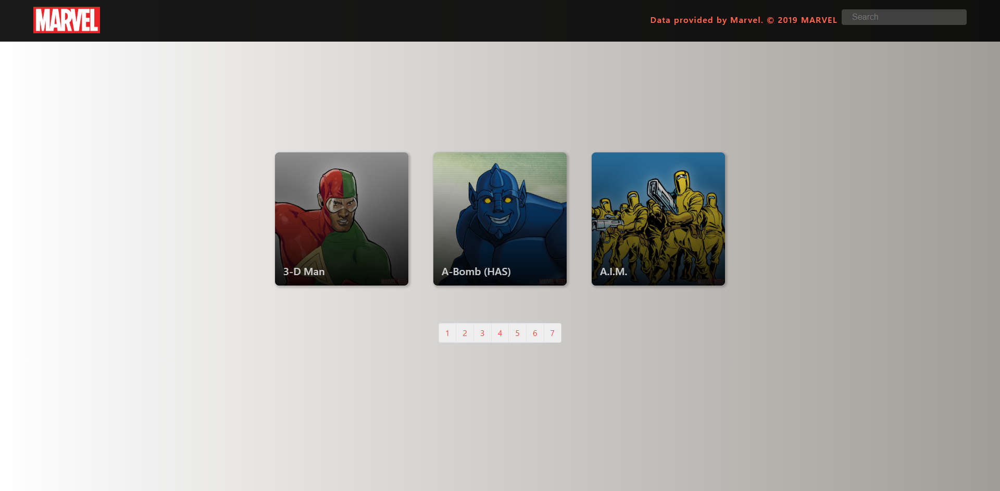
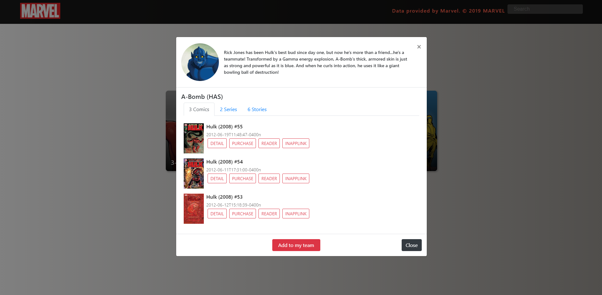

# React Challenge Using MARVEL API


This is a sample React app which demonstrates how to use the marvel API with React Hooks to show a list of marvel characters and a list of details for each character.

## Libs
 - [React Boostrap](https://react-bootstrap.github.io/)
 - [react-autosuggest](http://react-autosuggest.js.org/)
 - [Tachyons](http://tachyons.io/)
---
## Screenshot




## What it does?
This App must provide the follow functionalities:
 - A list of cards of characters loaded from the marvel API
 - Each card open a Modal with a collection of comics, stories and series

 # Get started

 ```
 $ git clone https://github.com/jakibenz/marvel
 $ cd react-marvel-catalog
 $ npm install
 $ npm start
 ```

 This sample was made with *Create React App* [(more information)](https://github.com/facebookincubator/create-react-app/issues/new) see the doc for requirements.